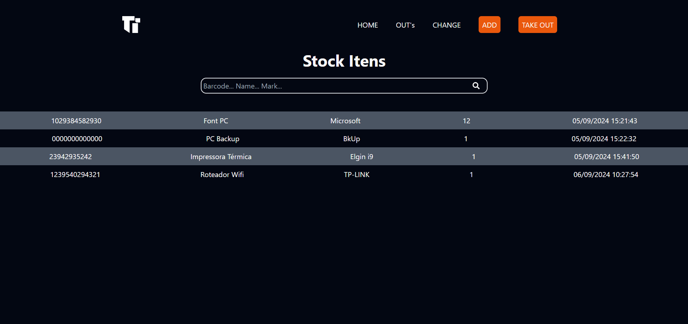

## Stock Manager TI

A problem with the TI sector is, every time something broke, we need to send or we need to repair the thing, and sometimes we are charged for the items. For stop this reclamations I build this sistem to control 
what comes out and what do we need.

I use mostly popular tecnologis in this projecs, like:

- React
- Vite
- React Router
- Typescript
- Tailwind

 

## To Run The Project

To run this project you will need to clone this repository on your pc, and init node, after that, run in your terminal:

``npm run dev``

To get the informations, you'll need to clone the API too, in this repository:

<a href="https://github.com/Frasato/EstoqueTI-API">Stock Manager API</a>